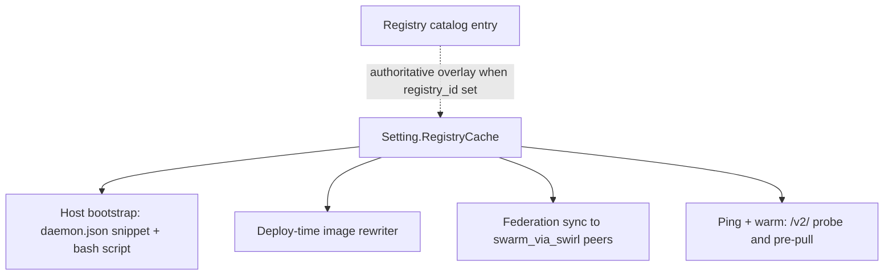
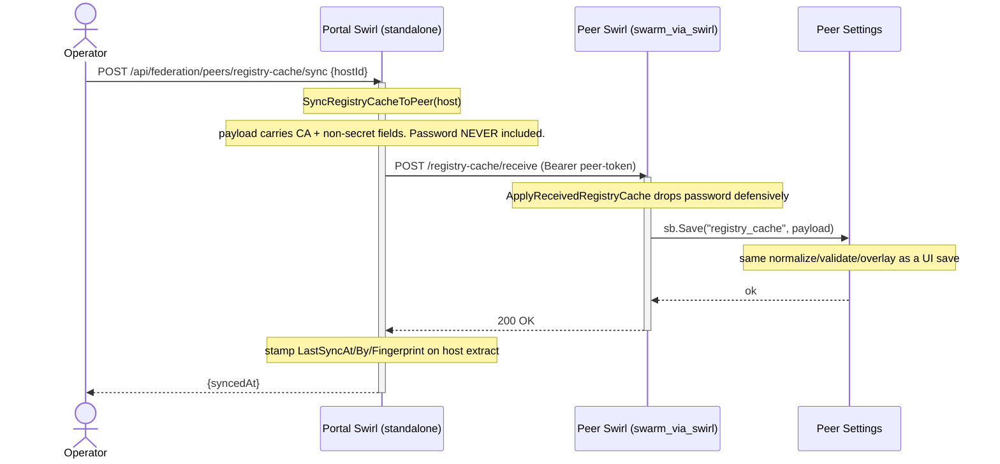

# Registry Cache

Swirl can drive every container image pull across the hosts it manages
through a single **pull-through registry** (e.g. `registry:2`, Harbor,
Nexus). The cache is operator-deployed; Swirl does **not** manage its
lifecycle. What Swirl does is:

1. Store the mirror's connection parameters in `Setting.RegistryCache`
   (and, optionally, link them to an entry in the Registry catalog).
2. Generate + distribute the CA that signs the mirror's TLS cert.
3. Produce a ready-to-paste `daemon.json` snippet + bootstrap shell
   script for each host that should trust the mirror.
4. Rewrite every `services.<svc>.image` reference at deploy time so
   the pull goes through the mirror.
5. Replicate the same configuration to remote Swarm peers over
   federation (`swarm_via_swirl` hosts), since the portal has no
   direct access to their daemons.

The configuration surface is **a global Setting** — there's one
active mirror per Swirl instance. Hosts opt in explicitly; stacks
can opt out explicitly. Digest-pinned refs pass through unrewritten.

---

## Architecture at a glance



`Setting.RegistryCache` fields: `enabled`, `registry_id` (optional
link), `hostname`, `port`, `ca_cert_pem`, `ca_fingerprint`,
`username`, `password`, `use_upstream_prefix`, `rewrite_mode`,
`preserve_digests`. When `registry_id` points at a Registry catalog
entry, `hostname`/`port`/`username`/`password`/`ca_cert_pem`/
`ca_fingerprint` are authoritatively sourced from that entry at every
Save (inline UI values are discarded).

The mirror URL Swirl builds is always `https://<hostname>:<port>`
(port defaults to 5000 — `registry:2` convention). HTTP-only is
reachable via the *insecure* toggle on the per-host bootstrap, not
via the global Setting.

---

## Settings (global)

**Location**: `Settings → Registry Cache` tab. Permission
`registry_cache.view / edit` (bit `1 << 23`, `registry_cache.*`).

### Fields (on `Setting.RegistryCache`)

| Field | Type | Default | Purpose |
|---|---|---|---|
| `enabled` | bool | `false` | Master switch. When off, bootstrap script generation, image rewriting, ping, federation sync are all disabled |
| `registry_id` | string | `""` | Optional link to an entry in the **Registry catalog**. When set, the next six fields are **authoritatively** sourced from the linked Registry at every Save — inline values submitted by the UI are ignored and overwritten |
| `hostname` | string | — | Hostname clients use to reach the mirror (e.g. `mirror.lan`) |
| `port` | int | `5000` | Mirror TCP port |
| `ca_cert_pem` | string (PEM) | `""` | CA certificate distributed to hosts via the bootstrap script. **Masked** on GET by `secretFieldsByID` |
| `ca_fingerprint` | string | *derived* | SHA-256 of the cert DER (hex, uppercase). Computed server-side at Save; safe to echo back |
| `username` | string | `""` | Optional — for auth'd mirrors |
| `password` | string | `""` | **Masked** on GET. Never sent cross-trust during federation sync |
| `use_upstream_prefix` | bool | `true` | Rewrite layout (see [Image rewriting](#image-rewriting)) |
| `rewrite_mode` | enum | `per-host` | `off` / `per-host` / `always` — scope of the deploy-time rewriter |
| `preserve_digests` | bool | `true` | Digest-pinned refs (`image@sha256:…`) pass through unrewritten |

### Validation

Enforced at Save time by `validateRegistryCache`:

- `enabled=true` ⇒ `hostname` is required and non-empty.
- `enabled=true` ⇒ `port ∈ [1, 65535]`.
- `rewrite_mode` must be one of `off` / `per-host` / `always`.
- Disabled blobs accept partial/empty values (operator WIP).

### Registry-link semantics

Setting `registry_id` to a non-empty ID tells Swirl: *the linked
Registry is authoritative*. On every Save:

1. The Registry is loaded.
2. `hostname` + `port` are parsed from `Registry.URL` (scheme-less
   URLs default to `https://`).
3. `username`, `password`, `ca_cert_pem`, `ca_fingerprint` are
   copied from the Registry — **any inline value in the UI is
   discarded**.
4. If the linked Registry has been deleted, `registry_id` is blanked
   silently; the rest of the fields stay inline.

This is implemented in `biz/registry_cache.go::overlayRegistryCacheFromRegistry`.
Consequence: editing the linked Registry's URL or CA transparently
propagates to every downstream consumer (rewriter, ping, sync,
bootstrap) on the next Registry Cache save. The UI signals the link
by disabling the now-overridden inline fields.

### Self-signed CA generation

`POST /api/registry-cache/gen-ca` (permission `registry_cache.edit`)
produces a fresh ECDSA P-256 CA pair:

- **Validity**: 10 years (typical internal-CA horizon).
- **Response**: `{certPEM, keyPEM}` — the **private key is returned
  once**. The operator downloads it, uses it to sign the mirror's
  server certificate offline, and Swirl never persists it.
- The public cert lands in `Setting.RegistryCache.CACertPEM` via a
  normal Save.

Rotation: regenerate anytime. The UI flags hosts whose
`AppliedFingerprint` / `LastSyncFingerprint` no longer matches the
current `CAFingerprint` — operators re-apply the bootstrap script
(or re-trigger federation sync) to refresh the trust.

### Ping

`POST /api/registry-cache/ping` (permission `registry_cache.view`)
issues `GET /v2/` against the mirror URL through a transport that
trusts the uploaded CA (if any). Treats **HTTP 200** (anonymous
access) and **HTTP 401** (auth required) as healthy — both prove
DNS + TLS + routing are fine. Any other status is a degraded
signal.

Response shape:
```json
{
  "ok": true,
  "status": 200,
  "latencyMs": 42,
  "mirrorUrl": "https://mirror.lan:5000"
}
```

---

## Host bootstrap (per-host opt-in)

Each host opts in separately under **Hosts → Edit → Addons →
Registry Cache** (`HostAddonRegistryCache.vue`). Stored on
`Host.AddonConfigExtract.registryCache` via `AddonExtractSave`; the
dedicated endpoints `POST /api/host/registry-cache-get` and `POST
/api/host/registry-cache-save` (permissions
`registry_cache.view / edit`) return the computed snippet + script
alongside the persisted state.

### Per-host fields (`RegistryCacheExtract`)

| Field | Type | Purpose |
|---|---|---|
| `enabled` | bool | Per-host opt-in toggle. When `rewrite_mode=per-host`, the deploy-time rewriter only fires for stacks whose host has this true |
| `insecureMode` | bool | Emits `insecure-registries` instead of installing the CA into `/etc/docker/certs.d/` (lab / dev only) |
| `appliedAt` / `appliedBy` / `appliedFingerprint` | — | Manual operator attestation that the current snippet is applied on the daemon. Used by the UI to flag stale trust after a CA rotation |
| `lastSyncAt` / `lastSyncBy` / `lastSyncFingerprint` | — | Populated **only** on `swarm_via_swirl` hosts. Set when the portal successfully pushes the config via federation (see below) |

**Swirl never writes `daemon.json` itself.** The operator copy-pastes
the generated script onto the host, or uses the "Mark as applied"
button after a manual merge. This is deliberate — daemon configuration
is an operator-owned surface, and Swirl doesn't want to take over SSH
or require a socket it doesn't already have.

### Generated snippet (`BuildDaemonSnippet`)

Fragment to merge into `/etc/docker/daemon.json`:

```json
{
  "registry-mirrors": ["https://mirror.lan:5000"]
}
```

With `insecureMode=true` (no TLS):

```json
{
  "registry-mirrors": ["https://mirror.lan:5000"],
  "insecure-registries": ["mirror.lan:5000"]
}
```

### Generated bootstrap script (`BuildBootstrapScript`)

A `bash` script that:

1. Refuses to run without `jq` (merge dependency).
2. Backs up the current `/etc/docker/daemon.json` to
   `<file>.bak.<timestamp>`.
3. Uses `jq -s '.[0] * .[1]'` to merge the snippet into the existing
   daemon config, **preserving unrelated keys**.
4. Installs the CA into
   `/etc/docker/certs.d/<hostname>:<port>/ca.crt` (TLS mode only).
5. Reloads `dockerd` via `systemctl reload docker`, falling back to
   `restart` and finally to `SIGHUP` (`registry-mirrors` is hot-reload
   friendly on recent Docker daemons).
6. Idempotent — re-running repeats the merge without harm.

The UI shows a **copy button** and a download action. The operator
runs the script as root (it uses `sudo` internally).

---

## Image rewriting

The deploy-time rewriter in `biz/compose_stack_registry_rewrite.go`
transforms every `services.<svc>.image` reference so pulls route
through the configured mirror. **The persisted YAML on the stack is
never mutated** — the rewriter produces a fresh byte-slice that the
engine consumes exactly once per deploy.

### Scope resolution (in order of precedence)

1. `ComposeStack.DisableRegistryCache = true` → skip.
2. `Setting.RegistryCache.Enabled = false` → skip.
3. `Setting.RegistryCache.Hostname = ""` → skip.
4. `Setting.RegistryCache.RewriteMode`:
   - `off` → skip.
   - `per-host` (default) → rewrite **only if** the target host's
     `AddonConfigExtract.RegistryCache.Enabled == true`.
   - `always` → rewrite unconditionally.
5. For each ref: if `PreserveDigests=true` and the ref contains
   `@sha256:`, pass through unrewritten with
   `Reason="digest-preserved"`.
6. Parse the ref via `distribution/reference.ParseNormalizedNamed`.
   Unparseable refs → pass through with `Reason="invalid-ref"`.
7. If the ref's domain already equals the mirror host:port, pass
   through with `Reason="already-mirror"`. Prevents double-nesting.

### Rewrite layout

Controlled by `UseUpstreamPrefix`:

| `use_upstream_prefix` | Layout | Fits |
|---|---|---|
| `true` (default) | `<mirror>/<upstream-domain>/<path>:<tag>` | Harbor/Nexus multi-upstream project layout (one path prefix per upstream) |
| `false` | `<mirror>/<path>:<tag>` | Single-upstream mirror dedicated to one registry (typically Docker Hub) |

Tag defaults to `:latest` when missing (consistent with Docker's
`reference.TagNameOnly`).

### Rewrite marker

A leading comment is attached to every rewritten image scalar:

```yaml
services:
  app:
    # swirl-managed-registry-cache: original=nginx:1.25
    image: mirror.lan:5000/docker.io/library/nginx:1.25
```

The marker is **audit-only** — `detectActiveAddons` uses it to show
the `registry-cache` chip on the stack list, and a future reverse
parser can map rewrites back to their originals without round-tripping
the whole deploy pipeline.

Re-running the rewriter on already-rewritten YAML is safe: the
`already-mirror` guard short-circuits, and the marker is appended
only when no prior marker is detected on that node.

### Preview endpoint

`POST /api/compose-stack/registry-cache-preview` (permission
`stack.view`) runs the rewriter as a dry-run and returns:

```json
{
  "mirrorEnabled": true,
  "wouldRewrite": true,
  "actions": [
    {"service":"web","original":"nginx:1.25","rewritten":"mirror.lan:5000/docker.io/library/nginx:1.25","upstream":"docker.io","prefix":"docker.io"},
    {"service":"worker","original":"alpine@sha256:…","reason":"digest-preserved"}
  ]
}
```

The Stack editor's Registry Cache tab consumes this to show a full
decision table before the operator hits Deploy.

### Warm (pre-pull)

`POST /api/compose-stack/registry-cache-warm` (permission
`stack.deploy`) runs the rewriter once and then issues `docker pull`
on every rewritten image ref **through the Swirl daemon's local
socket** — not through the target host. The mirror's cache is
populated up-front so the eventual deploy on the target host
experiences a warm pull. This is particularly useful for the first
deploy after the mirror goes live, or for pre-staging a release
across multiple hosts.

### Stack-level opt-out

`ComposeStack.DisableRegistryCache bool` — a checkbox on the stack
editor's Registry Cache tab. Persisted on the stack record. Overrides
every other decision in the precedence chain. Use cases:

- A stack that intentionally pulls from a private upstream that the
  mirror can't reach.
- A stack pinned by digest where the operator prefers the original
  public route.
- Troubleshooting — bypass the mirror to confirm it isn't the cause
  of a pull failure.

`detectActiveAddons` skips the `registry-cache` chip for opted-out
stacks.

---

## Federation delegation (Swarm peers)

**Context**: The standalone portal has no Docker socket on Swarm
peer nodes — federation is its only hands. For the Registry Cache
feature that means the portal cannot SSH into cluster nodes to apply
the bootstrap script, and the peer's own Swirl instance needs to
know about the mirror so its hosts' addons show the right state.

The solution is a dedicated push endpoint:



### Invariants

- **Host type gate**: `SyncRegistryCacheToPeer` refuses any host
  whose `Type != "swarm_via_swirl"`. Standalone hosts use the
  bootstrap script path — federation sync would be a dead letter.
- **Password never crosses the trust boundary**. The peer admin
  configures the mirror credential locally via Settings (or via the
  linked Registry on the peer side). Federation sync **never rotates
  it** — in fact the peer handler re-applies `delete(payload,
  "password")` defensively, so even a misbehaving portal cannot
  wipe the peer's credential.
- **CA is public and travels**. Fingerprint distribution to the
  peer's hosts is still manual (operators on the peer run the
  bootstrap script there) — the portal's `LastSyncFingerprint` is
  an attestation that the *peer's Settings* carry the fingerprint,
  not that *every cluster node* trusts it.
- **Receive handler auth**: `auth:"?"` — bearer peer-token only, no
  session. Federation requests always carry `X-Swirl-Originating-User`
  (audit-only).

### UI

The Hosts list shows a Registry Cache status pill per
`swarm_via_swirl` host: green when `LastSyncFingerprint` matches the
current `Setting.RegistryCache.CAFingerprint`, amber when stale,
grey when never synced. A button on the host edit page triggers
`POST /api/federation/peers/registry-cache/sync`.

The Dashboard (Home) surfaces a compact card:
- Mirror URL + ping status.
- Number of hosts where `Enabled=true`.
- Number of stale-fingerprint hosts.

---

## Permissions

| Permission | Actions | Where it gates |
|---|---|---|
| `registry_cache.view` | read | `Settings → Registry Cache` tab (read), `/api/registry-cache/ping`, `/api/host/registry-cache-get` |
| `registry_cache.edit` | write | `Settings → Registry Cache` save, `/api/registry-cache/gen-ca`, `/api/host/registry-cache-save`, `/api/federation/peers/registry-cache/sync` |

Bit `1 << 23` in `security/perm.go`, mirrored into
`ui/src/utils/perm.ts`. Resources table in the Roles editor shows
`objects.registry_cache` label (en/it/zh).

The `stack-level` preview + warm endpoints intentionally reuse
`stack.view` / `stack.deploy` — rewriting a stack's images is a
deploy-scoped concern, not a feature-admin concern.

---

## Frequently asked

**Why not just push `insecure-registries` everywhere?**
It works, but the blast radius is larger than necessary: every host
that trusts `insecure-registries: [mirror.lan:5000]` will accept
*any* HTTP(S) registry at that endpoint without cert validation. The
default path distributes a dedicated CA that trusts only the mirror.
`insecureMode` remains available per-host for lab/dev.

**Does it proxy pulls through Swirl?**
No. Swirl never sits in the image data path. At deploy time it
rewrites the ref; the actual pull goes from the daemon on the
target host → the mirror directly.

**How do I roll back?**
On the stack: tick `Disable Registry Cache` and redeploy — the
original YAML images are pulled. On the host: remove the
`registry-mirrors` line from `/etc/docker/daemon.json` and reload
the daemon (the bootstrap script backs up the previous daemon.json
before merging).

**Can I rewrite refs across multiple upstreams with one mirror?**
Yes. `use_upstream_prefix=true` generates `<mirror>/<upstream>/<path>`,
which is exactly what Harbor / Nexus expect when they proxy several
upstreams (one project per upstream). A Docker Hub-only mirror is
fine with `use_upstream_prefix=false`.

**What about Swarm stacks on the portal itself?**
On a standalone portal, Swarm stacks live on federated `swarm_via_swirl`
hosts; the peer Swirl is the engine for those. The portal's Registry
Cache Setting applies to stacks deployed on *local* standalone hosts.
Peers run their own rewriter against their own (federation-synced)
Setting.

---

## File reference

- `biz/registry_cache.go` — normalize / validate / CA gen /
  fingerprint / snippet + script builders / ping.
- `biz/registry_cache_federation.go` — portal → peer sync (+ peer-
  side apply).
- `biz/compose_stack_registry_rewrite.go` — deploy-time image
  rewriter, preview, scope decisions.
- `biz/host_addon_extract.go` — `RegistryCacheExtract` per-host
  state.
- `api/registry_cache.go` — `/gen-ca`, `/ping`.
- `api/host.go` — `/registry-cache-get`, `/registry-cache-save`.
- `api/compose_stack.go` — `/registry-cache-preview`,
  `/registry-cache-warm`.
- `api/federation.go` — `/peers/registry-cache/sync`,
  `/registry-cache/receive`.
- `misc/option.go::Setting.RegistryCache` — global setting struct.
- `dao/entity.go::ComposeStack.DisableRegistryCache` — per-stack
  opt-out.
- `ui/src/pages/setting/Setting.vue` — Registry Cache tab.
- `ui/src/components/host-addons/HostAddonRegistryCache.vue` —
  per-host panel.
- `ui/src/components/stack-addons/AddonTabRegistryCache.vue` —
  stack editor tab.
- `ui/src/pages/Home.vue` — dashboard card.

See also: [docs/federation.md](federation.md),
[docs/stack-addons.md](stack-addons.md).
